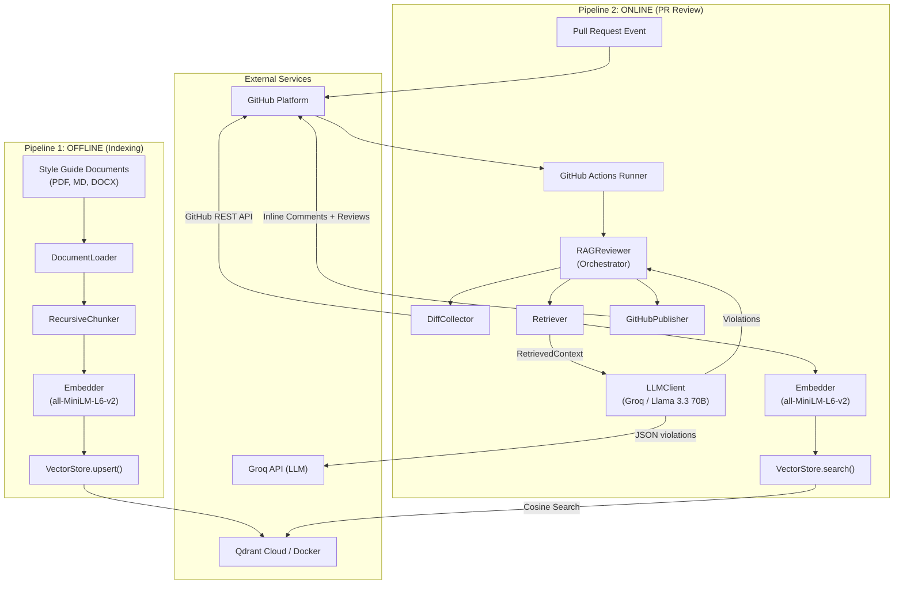
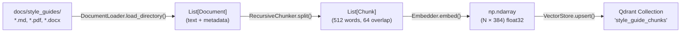
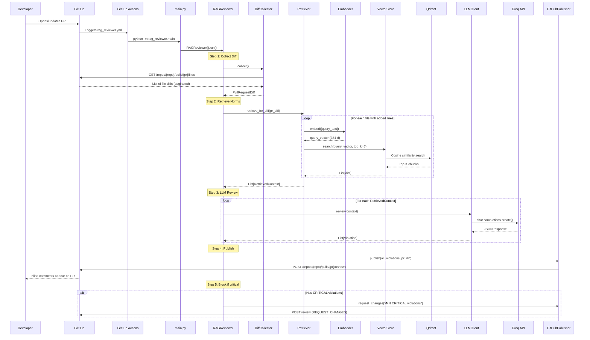
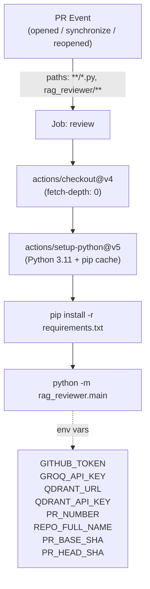
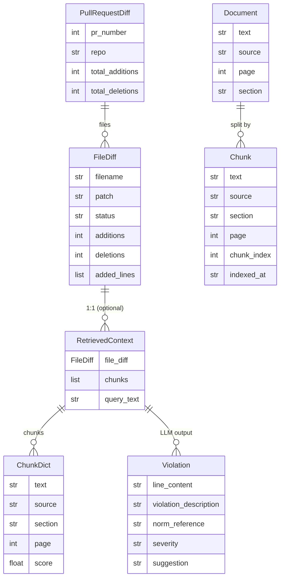
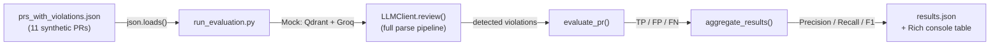
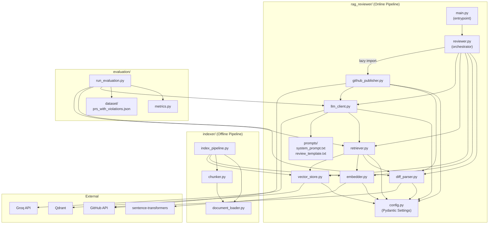

# RAG-Reviewer: Complete System Roadmap

> **Purpose**: End-to-end documentation of every component, data flow, and integration in the RAG-Reviewer system — from style guide ingestion to PR review publication. This document serves as the **single source of truth** for creating the system architecture diagram.

---

## 1. System Overview

**RAG-Reviewer** is an automated code governance tool that integrates with GitHub Actions. On every Pull Request event, it semantically retrieves organizational style guide norms relevant to the code changes and publishes traceable inline review comments citing the specific violated norm.

**Academic Context**: Final project for Universidade do Estado do Amazonas (UEA) — _"RAG-Reviewer: Automação de Governança de Código via GitHub Actions e Inteligência Artificial Generativa"_

### 1.1 Core Concept

| Traditional Approach | RAG-Reviewer |
|---|---|
| Human reviewers manually check style guide compliance | Automated detection before human review |
| Style guides in PDFs/Wikis are never consulted during PR | Norms are semantically retrieved and applied per PR |
| Linters only verify predefined syntactic rules | System interprets natural-language guidelines |
| Generic LLMs (Copilot, CodeRabbit) ignore internal norms | LLM is contextualized with the organization's norm corpus |

---

## 2. High-Level Architecture



---

## 3. Two Pipelines

### 3.1 Pipeline Overview

| Pipeline | When it runs | Responsibility |
|---|---|---|
| **Offline (Indexing)** | Manually or when the style guide is updated | Processes style guide documents, generates embeddings, populates Qdrant |
| **Online (Review)** | On every PR open/update/reopen | Collects diff, queries Qdrant, generates review, publishes comments |

---

## 4. Pipeline 1 — Offline Indexing (Complete Flow)



### 4.1 Step 1 — Document Loading

**File**: [document_loader.py](file:///c:/Users/Thiago/Desktop/dev/RAG-CI-CD/indexer/document_loader.py)

| Format | Library | Extraction strategy |
|---|---|---|
| PDF (`.pdf`) | `pypdf.PdfReader` | Text per page; page number as metadata |
| Markdown (`.md`, `.txt`) | Regex heading parser | Splits by `#`, `##`, `###` headings; section title as metadata |
| DOCX (`.docx`) | `python-docx` | Groups paragraphs by Heading styles |

**Key Classes**:
- `Document` — dataclass: `text`, `source`, `page`, `section`
- `DocumentLoader` — methods: `load(path)`, `load_directory(directory)`, `_load_pdf()`, `_load_markdown()`, `_load_docx()`, `_clean_text()`

### 4.2 Step 2 — Chunking

**File**: [chunker.py](file:///c:/Users/Thiago/Desktop/dev/RAG-CI-CD/indexer/chunker.py)

**Strategy**: Sliding window with overlap, respecting natural boundaries.

| Parameter | Value | Rationale |
|---|---|---|
| `chunk_size` | 512 words | Balances context and retrieval precision |
| `chunk_overlap` | 64 words | Prevents splitting rules across chunk boundaries |
| Separators (priority) | `\n\n` → `\n` → `. ` → `! ` → `? ` → ` ` | Respects document structure |

**Key Classes**:
- `Chunk` — dataclass: `text`, `source`, `section`, `page`, `chunk_index`, `indexed_at`
- `RecursiveChunker` — methods: `split(documents)`, `_split_text()`, `_merge_splits()`, `_hard_split()`

### 4.3 Step 3 — Embedding Generation

**File**: [embedder.py](file:///c:/Users/Thiago/Desktop/dev/RAG-CI-CD/rag_reviewer/embedder.py) (shared between pipelines)

| Property | Value |
|---|---|
| Model | `all-MiniLM-L6-v2` (sentence-transformers) |
| Dimensions | 384 |
| Cost | Free (runs locally) |
| Normalization | L2-normalized for cosine similarity |
| Batch size | 32 |

**Key Class**:
- `Embedder` — methods: `embed(texts) → np.ndarray`, `embed_single(text)`, properties: `model_name`, `vector_size`

### 4.4 Step 4 — Qdrant Insertion

**File**: [vector_store.py](file:///c:/Users/Thiago/Desktop/dev/RAG-CI-CD/rag_reviewer/vector_store.py) (shared between pipelines)

- Creates/recreates collection with HNSW config (`m=16`, `ef_construct=100`)
- Distance metric: **Cosine**
- Upserts in batches of 100 with UUID point IDs

**Payload Schema per Point**:
```json
{
  "text": "Chunk text content",
  "source": "docs/style_guides/coding_standards.md",
  "section": "Section 3.2 — Function Naming",
  "page": 0,
  "chunk_index": 12,
  "char_count": 487,
  "indexed_at": "2025-01-15T10:00:00Z"
}
```

### 4.5 Pipeline Orchestrator

**File**: [index_pipeline.py](file:///c:/Users/Thiago/Desktop/dev/RAG-CI-CD/indexer/index_pipeline.py)

**Function**: `run_indexing(docs_dir, collection_name, recreate, chunk_size, chunk_overlap) → dict`

Can be executed via:
- CLI: `python -m indexer.index_pipeline --docs-dir docs/style_guides --recreate`
- Makefile: `make index` or `make index-recreate`

---

## 5. Pipeline 2 — Online PR Review (Complete Flow)



### 5.1 Step 1 — Diff Collection

**File**: [diff_parser.py](file:///c:/Users/Thiago/Desktop/dev/RAG-CI-CD/rag_reviewer/diff_parser.py)

**DiffCollector** reads env vars via `get_settings()`:
- `GITHUB_TOKEN`, `REPO_FULL_NAME`, `PR_NUMBER`
- Uses GitHub REST API: `GET /repos/{repo}/pulls/{pr_number}/files` with pagination (100 per page)

**Filtering**:
- Skips deleted files (no code to review)
- Skips ignored extensions: `.png`, `.jpg`, `.pdf`, `.zip`, `.lock`, `.exe`, `.dll`, etc.
- Skips files without a patch (binary files)
- Extracts only added lines (removes `+` prefix, ignores `+++` headers)

**Key Functions**:
- `build_query_text(file_diff, max_chars=2000) → str` — Prepends filename for context, truncates with `[TRUNCADO]` marker

**Data Models**:
- `FileDiff` — `filename`, `patch`, `status`, `additions`, `deletions`, `added_lines`
- `PullRequestDiff` — `pr_number`, `repo`, `files`, `total_additions`, `total_deletions`

### 5.2 Step 2 — Semantic Retrieval (RAG)

**File**: [retriever.py](file:///c:/Users/Thiago/Desktop/dev/RAG-CI-CD/rag_reviewer/retriever.py)

For each file with added lines:
1. Builds query text via `build_query_text(file_diff)`
2. Generates embedding via `Embedder.embed([query_text])`
3. Searches Qdrant via `VectorStore.search(query_vector, top_k, score_threshold)`
4. Packages result in `RetrievedContext`

| Parameter | Default | Source |
|---|---|---|
| `top_k` | 5 | `TOP_K_CHUNKS` env var |
| `score_threshold` | 0.55 | `SCORE_THRESHOLD` env var |

**Data Model**:
- `RetrievedContext` — `file_diff: FileDiff`, `chunks: list[dict]`, `query_text: str`

### 5.3 Step 3 — LLM Review

**File**: [llm_client.py](file:///c:/Users/Thiago/Desktop/dev/RAG-CI-CD/rag_reviewer/llm_client.py)

**LLM Provider**: Groq API (free tier) with model `llama-3.3-70b-versatile`

**Prompt Structure**:
1. **System Prompt** ([system_prompt.txt](file:///c:/Users/Thiago/Desktop/dev/RAG-CI-CD/rag_reviewer/prompts/system_prompt.txt)): 8 strict rules including "only cite documented norms", "respond only in JSON", "don't invent norms"
2. **Review Template** ([review_template.txt](file:///c:/Users/Thiago/Desktop/dev/RAG-CI-CD/rag_reviewer/prompts/review_template.txt)): Injects `{filename}`, `{added_lines}`, `{retrieved_chunks}` and requests JSON output

**JSON Response Schema**:
```json
{
  "violations": [
    {
      "line_content": "exact line from PR",
      "violation_description": "clear description",
      "norm_reference": "document + section/page",
      "severity": "CRITICAL | HIGH | MEDIUM | LOW",
      "suggestion": "how to fix"
    }
  ]
}
```

**Defensive Parsing**:
1. Direct `json.loads()`
2. Fallback: regex extraction of ` ```json {...} ``` ` blocks
3. Severity normalization (uppercase, fallback to `LOW`)
4. Invalid violation entries are logged and skipped

**Data Model**:
- `Violation` — `line_content`, `violation_description`, `norm_reference`, `severity`, `suggestion`

### 5.4 Step 4 — GitHub Publishing

**File**: [github_publisher.py](file:///c:/Users/Thiago/Desktop/dev/RAG-CI-CD/rag_reviewer/github_publisher.py)

**Strategy**:
1. For each violation with locatable `line_content` → **inline review comment** at the correct diff position
2. A single consolidated review with all comments (avoids API rate limiting)
3. Summary table with severity counts in the review body

**Comment Format**:
```
⛔ **[CRITICAL]** Description of the violation

📖 **Norma violada:** `coding_standards.md#3.2`

💡 **Sugestão:** How to fix the violation
```

**Diff Position Calculation** (`_find_diff_position()`):
- Iterates patch lines counting position (1-indexed)
- `@@` hunk headers increment position
- `-` removed lines do NOT increment position
- `+` and context lines increment position
- Matches violation `line_content` against added lines via substring search

### 5.5 Step 5 — PR Status Decision

If `BLOCK_ON_CRITICAL=true` and there are CRITICAL violations:
- `GitHubPublisher.request_changes()` is called
- Posts a `REQUEST_CHANGES` review event to block the merge

### 5.6 Orchestrator

**File**: [reviewer.py](file:///c:/Users/Thiago/Desktop/dev/RAG-CI-CD/rag_reviewer/reviewer.py)

**Class**: `RAGReviewer` — coordinates the entire online pipeline.

All components are **injectable** via constructor for testing:
```python
RAGReviewer(
    collector: DiffCollector | None,
    embedder: Embedder | None,
    store: VectorStore | None,
    retriever: Retriever | None,
    llm: LLMClient | None,
    publisher: GitHubPublisher | None  # lazy import
)
```

**Entrypoint**: [main.py](file:///c:/Users/Thiago/Desktop/dev/RAG-CI-CD/rag_reviewer/main.py) — `python -m rag_reviewer.main`

---

## 6. Configuration System

**File**: [config.py](file:///c:/Users/Thiago/Desktop/dev/RAG-CI-CD/rag_reviewer/config.py)

Uses **Pydantic BaseSettings** (`pydantic-settings`) with `@lru_cache` singleton pattern.

```mermaid
graph LR
    ENV[".env file"] -->|load_dotenv| Settings
    GHA["GitHub Actions env vars"] -->|override=False| Settings
    Settings -->|get_settings()| Modules["All modules"]
```

| Setting | Env Variable | Default |
|---|---|---|
| `github_token` | `GITHUB_TOKEN` | `""` |
| `repo_full_name` | `REPO_FULL_NAME` | `""` |
| `pr_number` | `PR_NUMBER` | `0` |
| `pr_head_sha` | `PR_HEAD_SHA` | `""` |
| `pr_base_sha` | `PR_BASE_SHA` | `""` |
| `groq_api_key` | `GROQ_API_KEY` | `""` |
| `llm_model` | `LLM_MODEL` | `"llama-3.3-70b-versatile"` |
| `qdrant_url` | `QDRANT_URL` | `"http://localhost:6333"` |
| `qdrant_api_key` | `QDRANT_API_KEY` | `""` |
| `qdrant_collection` | `QDRANT_COLLECTION` | `"style_guide_chunks"` |
| `embedding_model` | `EMBEDDING_MODEL` | `"all-MiniLM-L6-v2"` |
| `top_k_chunks` | `TOP_K_CHUNKS` | `5` |
| `score_threshold` | `SCORE_THRESHOLD` | `0.55` |
| `max_diff_tokens` | `MAX_DIFF_TOKENS` | `3000` |
| `block_on_critical` | `BLOCK_ON_CRITICAL` | `true` |

---

## 7. CI/CD Workflows (GitHub Actions)

### 7.1 Main Workflow — PR Review

**File**: [rag_reviewer.yml](file:///c:/Users/Thiago/Desktop/dev/RAG-CI-CD/.github/workflows/rag_reviewer.yml)



| Setting | Value | Purpose |
|---|---|---|
| `permissions.pull-requests` | `write` | Post review comments |
| `timeout-minutes` | `10` | Prevent runaway costs |
| `fetch-depth` | `0` | Full git history for diff |

### 7.2 Keep-Alive Workflow

**File**: [keep_alive.yml](file:///c:/Users/Thiago/Desktop/dev/RAG-CI-CD/.github/workflows/keep_alive.yml)

- **Cron**: Every 3 days at 00:00 UTC (`0 0 */3 * *`)
- **Purpose**: Prevent Qdrant Cloud free tier from suspending after 72h of inactivity
- **Action**: Pings `GET $QDRANT_URL/collections` with API key

---

## 8. Data Model Relationships



---

## 9. External Services & Dependencies

### 9.1 External Services

| Service | Role | Configuration |
|---|---|---|
| **Qdrant Cloud** (or Docker) | Vector database for style guide chunks | `QDRANT_URL` + `QDRANT_API_KEY` |
| **Groq API** | LLM inference (Llama 3.3 70B) | `GROQ_API_KEY` |
| **GitHub REST API** | PR diff collection + review publishing | `GITHUB_TOKEN` (auto-injected) |
| **HuggingFace Hub** | Model download for `all-MiniLM-L6-v2` | No key required |

### 9.2 Python Dependencies

| Category | Packages |
|---|---|
| **Embeddings & NLP** | `sentence-transformers==3.0.1`, `torch`, `numpy` |
| **Vector Database** | `qdrant-client==1.9.1` |
| **LLM Orchestration** | `groq==0.13.1` |
| **Document Processing** | `pypdf==4.2.0`, `python-docx==1.1.0`, `markdown==3.6`, `beautifulsoup4==4.12.3` |
| **GitHub API** | `PyGithub==2.3.0`, `requests==2.32.3` |
| **Utilities** | `python-dotenv==1.0.1`, `pydantic==2.7.4`, `pydantic-settings==2.3.4`, `tiktoken==0.7.0`, `rich==13.7.1` |
| **Dev tools** | `pytest`, `pytest-cov`, `black`, `ruff`, `mypy` |

---

## 10. Style Guides (Knowledge Base)

**Directory**: [docs/style_guides/](file:///c:/Users/Thiago/Desktop/dev/RAG-CI-CD/docs/style_guides)

| File | Description |
|---|---|
| [coding_standards.md](file:///c:/Users/Thiago/Desktop/dev/RAG-CI-CD/docs/style_guides/coding_standards.md) | General coding standards |
| [architecture_patterns.md](file:///c:/Users/Thiago/Desktop/dev/RAG-CI-CD/docs/style_guides/architecture_patterns.md) | Architecture patterns guide |
| [guia_python_pep8.md](file:///c:/Users/Thiago/Desktop/dev/RAG-CI-CD/docs/style_guides/guia_python_pep8.md) | Python PEP 8 style guide (Portuguese) |

These documents are the **source of truth** — they are indexed into Qdrant and retrieved during reviews.

---

## 11. Evaluation Framework

### 11.1 Architecture



### 11.2 Components

**File**: [run_evaluation.py](file:///c:/Users/Thiago/Desktop/dev/RAG-CI-CD/evaluation/run_evaluation.py)
- Uses `unittest.mock` to mock Qdrant and Groq API
- Constructs mock LLM responses from ground truth
- Exercises the full pipeline: parse → retrieval context → prompt build → JSON parse

**File**: [metrics.py](file:///c:/Users/Thiago/Desktop/dev/RAG-CI-CD/evaluation/metrics.py)
- `EvaluationResult` — per-PR: `true_positives`, `false_positives`, `false_negatives`, computed `precision`, `recall`, `f1_score`
- `AggregatedResult` — global: micro/macro averages of all metrics
- `match_violation()` — match criteria: substring match on `line_content` OR `norm_reference` (case-insensitive)
- `evaluate_pr()` — bipartite matching (greedy) between detected and expected violations

### 11.3 Dataset

**File**: [prs_with_violations.json](file:///c:/Users/Thiago/Desktop/dev/RAG-CI-CD/evaluation/dataset/prs_with_violations.json) — 11 synthetic PRs with cataloged violations

### 11.4 Latest Results

**File**: [results.json](file:///c:/Users/Thiago/Desktop/dev/RAG-CI-CD/evaluation/results.json)

| Metric | Value | Target |
|---|---|---|
| Micro Precision | **1.0000** | ≥ 0.70 ✅ |
| Micro Recall | **1.0000** | ≥ 0.65 ✅ |
| Micro F1-Score | **1.0000** | ≥ 0.67 ✅ |
| Total PRs evaluated | 11 | ≥ 30 (target) |
| Total TPs | 17 | — |
| Total FPs | 0 | — |
| Total FNs | 0 | — |

> [!NOTE]
> Perfect scores (1.0) are expected because the evaluation mocks the LLM response from the ground truth — this validates the pipeline mechanics (parsing, matching, metrics calculation), not the LLM quality itself.

---

## 12. Testing Strategy

### 12.1 Test Structure

```
tests/
├── __init__.py
├── unit/
│   ├── test_diff_parser.py        (19,341 bytes)
│   ├── test_document_loader.py     (7,695 bytes)
│   ├── test_chunker.py             (7,915 bytes)
│   ├── test_embedder.py            (5,585 bytes)
│   ├── test_retriever.py          (14,192 bytes)
│   ├── test_llm_client.py        (24,750 bytes)
│   └── test_github_publisher.py  (22,016 bytes)
└── integration/
    └── test_rag_pipeline.py      (12,606 bytes)
```

### 12.2 Coverage Targets

| Metric | Target |
|---|---|
| Unit test coverage | ≥ 80% |
| Ruff lint | 0 warnings |
| Mypy type check | 0 errors |

### 12.3 Commands

```bash
make test           # All tests (unit + integration)
make test-unit      # Unit tests only
make test-integration  # Integration tests only
make test-cov       # Tests with HTML coverage report
make lint           # Ruff check
make typecheck      # Mypy check
```

---

## 13. Architecture Decision Records (ADRs)

| ADR | Decision | Rationale |
|---|---|---|
| [ADR-001](file:///c:/Users/Thiago/Desktop/dev/RAG-CI-CD/docs/adr/ADR-001-vector-db.md) | **Qdrant** as vector DB | Free, self-hostable, excellent Python SDK, payload filters |
| [ADR-002](file:///c:/Users/Thiago/Desktop/dev/RAG-CI-CD/docs/adr/ADR-002-embedding-model.md) | **all-MiniLM-L6-v2** for dev; `text-embedding-3-small` for prod | Free local execution; good semantic similarity on code/text |
| [ADR-003](file:///c:/Users/Thiago/Desktop/dev/RAG-CI-CD/docs/adr/ADR-003-llm-choice.md) | **Groq / Llama 3.3 70B** | Free tier; fast inference; good structured JSON output |

> [!IMPORTANT]
> The actual implementation uses **Groq API** with **Llama 3.3 70B** (not Claude/OpenAI as originally planned). This deviation from the planning document reflects a cost optimization decision — Groq provides a free tier.

---

## 14. Complete Module Dependency Graph



---

## 15. Complete File Inventory

### 15.1 Source Code (10 modules + 2 prompts)

| File | Size | Role |
|---|---|---|
| [rag_reviewer/__init__.py](file:///c:/Users/Thiago/Desktop/dev/RAG-CI-CD/rag_reviewer/__init__.py) | 215 B | Package init |
| [rag_reviewer/config.py](file:///c:/Users/Thiago/Desktop/dev/RAG-CI-CD/rag_reviewer/config.py) | 3.6 KB | Centralized settings (Pydantic) |
| [rag_reviewer/main.py](file:///c:/Users/Thiago/Desktop/dev/RAG-CI-CD/rag_reviewer/main.py) | 709 B | Entrypoint |
| [rag_reviewer/diff_parser.py](file:///c:/Users/Thiago/Desktop/dev/RAG-CI-CD/rag_reviewer/diff_parser.py) | 11.8 KB | Diff collection & parsing |
| [rag_reviewer/embedder.py](file:///c:/Users/Thiago/Desktop/dev/RAG-CI-CD/rag_reviewer/embedder.py) | 4.0 KB | Embedding generation |
| [rag_reviewer/vector_store.py](file:///c:/Users/Thiago/Desktop/dev/RAG-CI-CD/rag_reviewer/vector_store.py) | 6.8 KB | Qdrant interface |
| [rag_reviewer/retriever.py](file:///c:/Users/Thiago/Desktop/dev/RAG-CI-CD/rag_reviewer/retriever.py) | 8.7 KB | Semantic retrieval (RAG) |
| [rag_reviewer/llm_client.py](file:///c:/Users/Thiago/Desktop/dev/RAG-CI-CD/rag_reviewer/llm_client.py) | 9.9 KB | LLM interface (Groq) |
| [rag_reviewer/reviewer.py](file:///c:/Users/Thiago/Desktop/dev/RAG-CI-CD/rag_reviewer/reviewer.py) | 7.4 KB | Pipeline orchestrator |
| [rag_reviewer/github_publisher.py](file:///c:/Users/Thiago/Desktop/dev/RAG-CI-CD/rag_reviewer/github_publisher.py) | 11.4 KB | PR comment publisher |
| [rag_reviewer/prompts/system_prompt.txt](file:///c:/Users/Thiago/Desktop/dev/RAG-CI-CD/rag_reviewer/prompts/system_prompt.txt) | 859 B | LLM system prompt |
| [rag_reviewer/prompts/review_template.txt](file:///c:/Users/Thiago/Desktop/dev/RAG-CI-CD/rag_reviewer/prompts/review_template.txt) | 644 B | Review prompt template |
| [indexer/__init__.py](file:///c:/Users/Thiago/Desktop/dev/RAG-CI-CD/indexer/__init__.py) | 233 B | Package init |
| [indexer/document_loader.py](file:///c:/Users/Thiago/Desktop/dev/RAG-CI-CD/indexer/document_loader.py) | 9.7 KB | Multi-format document loading |
| [indexer/chunker.py](file:///c:/Users/Thiago/Desktop/dev/RAG-CI-CD/indexer/chunker.py) | 6.9 KB | Sliding window chunking |
| [indexer/index_pipeline.py](file:///c:/Users/Thiago/Desktop/dev/RAG-CI-CD/indexer/index_pipeline.py) | 8.1 KB | Indexing orchestrator + CLI |

### 15.2 Configuration & Infrastructure

| File | Role |
|---|---|
| [.env.example](file:///c:/Users/Thiago/Desktop/dev/RAG-CI-CD/.env.example) | Environment variable template |
| [requirements.txt](file:///c:/Users/Thiago/Desktop/dev/RAG-CI-CD/requirements.txt) | Production dependencies |
| [requirements-dev.txt](file:///c:/Users/Thiago/Desktop/dev/RAG-CI-CD/requirements-dev.txt) | Development dependencies |
| [pyproject.toml](file:///c:/Users/Thiago/Desktop/dev/RAG-CI-CD/pyproject.toml) | Project metadata & tool config |
| [Makefile](file:///c:/Users/Thiago/Desktop/dev/RAG-CI-CD/Makefile) | Build automation (13 targets) |
| [conftest.py](file:///c:/Users/Thiago/Desktop/dev/RAG-CI-CD/conftest.py) | Pytest root configuration |
| [.github/workflows/rag_reviewer.yml](file:///c:/Users/Thiago/Desktop/dev/RAG-CI-CD/.github/workflows/rag_reviewer.yml) | Main CI/CD workflow |
| [.github/workflows/keep_alive.yml](file:///c:/Users/Thiago/Desktop/dev/RAG-CI-CD/.github/workflows/keep_alive.yml) | Qdrant keep-alive cron |

### 15.3 Documentation

| File | Role |
|---|---|
| [README.md](file:///c:/Users/Thiago/Desktop/dev/RAG-CI-CD/README.md) | Project documentation |
| [RAG-Reviewer_Planejamento.md](file:///c:/Users/Thiago/Desktop/dev/RAG-CI-CD/RAG-Reviewer_Planejamento.md) | Detailed implementation planning (50 KB) |
| [docs/adr/ADR-001-vector-db.md](file:///c:/Users/Thiago/Desktop/dev/RAG-CI-CD/docs/adr/ADR-001-vector-db.md) | Vector DB decision |
| [docs/adr/ADR-002-embedding-model.md](file:///c:/Users/Thiago/Desktop/dev/RAG-CI-CD/docs/adr/ADR-002-embedding-model.md) | Embedding model decision |
| [docs/adr/ADR-003-llm-choice.md](file:///c:/Users/Thiago/Desktop/dev/RAG-CI-CD/docs/adr/ADR-003-llm-choice.md) | LLM choice decision |

---

## 16. Design Patterns Used

| Pattern | Where | Purpose |
|---|---|---|
| **Dependency Injection** | `RAGReviewer.__init__()` | All components are injectable for testing |
| **Lazy Loading** | `Embedder`, `VectorStore`, `LLMClient`, `GitHubPublisher` | Defers expensive imports/connections until first use |
| **Singleton** | `get_settings()` with `@lru_cache` | Single settings instance across modules |
| **Strategy** | `RecursiveChunker._SEPARATORS` | Tries separators in priority order |
| **Dataclass DTOs** | All data models | Typed, immutable data transfer objects |
| **Defensive Parsing** | `LLMClient._extract_json()` | Multi-strategy JSON extraction from LLM output |

---

## 17. Summary: End-to-End Data Flow

```
┌─────────────────────────────────────────────────────────────────────┐
│                    PIPELINE 1 (OFFLINE — One-time)                   │
│                                                                     │
│  PDF/MD/DOCX → DocumentLoader → RecursiveChunker → Embedder        │
│     docs/        List[Document]    List[Chunk]      np.ndarray      │
│  style_guides/                                      (N × 384)       │
│                                                         │           │
│                                          VectorStore.upsert() ──→ Qdrant │
└─────────────────────────────────────────────────────────────────────┘

┌─────────────────────────────────────────────────────────────────────┐
│              PIPELINE 2 (ONLINE — Every PR Event)                   │
│                                                                     │
│  PR Event → GitHub Actions → DiffCollector → PullRequestDiff        │
│                                                   │                 │
│                                    ┌──────────────┤                 │
│                                    │ per file      │                 │
│                                    ▼              ▼                 │
│                           build_query_text → Embedder.embed()       │
│                                    │                                │
│                                    ▼                                │
│                           VectorStore.search() → Qdrant             │
│                                    │                                │
│                                    ▼                                │
│                           RetrievedContext                           │
│                                    │                                │
│                                    ▼                                │
│                           LLMClient.review() → Groq API             │
│                                    │                                │
│                                    ▼                                │
│                           List[Violation]                            │
│                                    │                                │
│                                    ▼                                │
│                           GitHubPublisher.publish() → GitHub API     │
│                                    │                                │
│                                    ▼                                │
│                           Inline comments + Review on PR            │
│                           (+ REQUEST_CHANGES if CRITICAL)           │
└─────────────────────────────────────────────────────────────────────┘
```

---

> [!TIP]
> This roadmap contains all the information needed to produce the system architecture diagram. Every component, data flow, external service, and interaction is documented above with Mermaid diagrams that can be used directly or adapted for formal architecture visualization tools.
