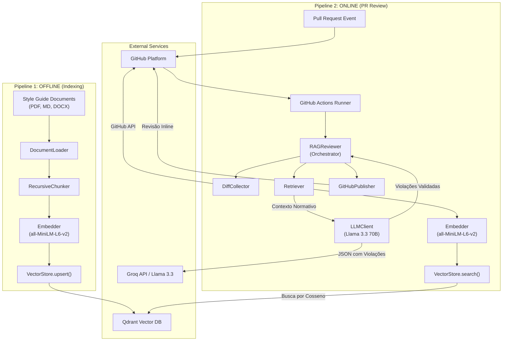

# Artefatos de Design (Metodologia DSR) — RAG-Reviewer

Este documento compila os artefatos de design desenvolvidos para o **RAG-Reviewer** segundo a metodologia **Design Science Research (DSR)** (March & Smith, 1995; Hevner et al., 2004). Ele está estruturado para ser exportado e incorporado diretamente ao capítulo de "Artefato de Design" ou "Concepção da Solução" do TCC-1.

---

## 1. Mapeamento dos Artefatos de Design (DSR)

Na metodologia DSR, o produto da pesquisa pode ser categorizado em quatro tipos de artefatos. A tabela abaixo mapeia cada elemento do RAG-Reviewer nessas categorias:

| Categoria | Descrição Geral | Artefato no RAG-Reviewer |
| :--- | :--- | :--- |
| **Construtos** | Vocabulário, termos e conceitos fundamentais do domínio do problema. | Definições de *Corpus Normativo*, *Chunk Semântico*, *Contexto Recuperado*, *Grafo de Similaridade Semântica*, *Violação Inline* e *Alinhamento de Linhas*. |
| **Modelos** | Abstrações que representam relações entre os construtos (arquiteturas, diagramas). | Diagrama de Arquitetura de Alto Nível, Pipeline de Ingestão (Offline), Pipeline de Análise (Online) e Esquema do Payload do Banco de Vetores. |
| **Métodos** | Algoritmos, passos de execução e processos operacionais da solução. | Algoritmo de Chunking Recursivo com Overlap, Algoritmo de Recuperação Semântica e Classificação por Threshold, e Estrutura de Engenharia de Prompting (JSON Schema). |
| **Instanciações** | Implementação física ou protótipo funcional que demonstra a viabilidade do design. | Protótipo funcional desenvolvido em Python 3.11, integração com o Qdrant, SDK da API do GitHub e o Workflow automatizado do GitHub Actions. |

---

## 2. Construtos (Vocabulário Conceitual)

Para formalizar a governança de código automatizada via RAG, são estabelecidos os seguintes construtos:

1. **Corpus Normativo (Norm Corpus):** O conjunto de documentos em linguagem natural (PDFs, Markdown, Word) que estabelecem as regras de design, guias de estilo e convenções de código da organização.
2. **Chunk Semântico (Semantic Chunk):** Segmento contínuo de texto do Corpus Normativo (composto por até 512 palavras e 64 palavras de sobreposição) que contém uma regra ou diretriz autocontida e contextualizada.
3. **Pull Request Diff (PR Diff):** O conjunto de linhas adicionadas, removidas ou modificadas em uma proposta de alteração de código, contendo metadados como nome do arquivo, números de linhas originais e novas.
4. **Vetor de Embedding (Embedding Vector):** Representação numérica densa de 384 dimensões (gerada pelo modelo `all-MiniLM-L6-v2`) de um chunk de texto ou de um fragmento de código, capturando seu significado semântico.
5. **Threshold de Similaridade ($\tau$):** Valor de corte numérico (estabelecido em $0.40$) para a similaridade por cosseno abaixo do qual um chunk normativo é descartado por ser considerado semanticamente irrelevante ao código sob revisão.
6. **Comentário de Violação Inline (Inline Violation Comment):** Feedback de revisão postado diretamente na linha exata do GitHub onde uma norma foi violada, contendo a justificativa, a citação à norma (documento e seção) e uma sugestão de correção.

---

## 3. Modelos (Arquitetura e Dados)

### 3.1 Arquitetura Geral de Alto Nível
O RAG-Reviewer divide-se em dois fluxos operacionais complementares: o **Pipeline Offline** (para carregamento e indexação das normas) e o **Pipeline Online** (para análise e publicação de revisões em tempo real nos PRs).



### 3.2 Payload Schema (Banco de Vetores Qdrant)
Cada vetor indexado no banco de dados possui metadados associados (*payload*). Este modelo de dados garante a rastreabilidade e a capacidade de filtragem rápida das normas:

```json
{
  "id": "c45a892b-81d3-4a1e-84b2-c0e86b0394ff",
  "vector": [0.015, -0.084, 0.112, "... (384 dimensões)"],
  "payload": {
    "text": "Classes Python devem utilizar padrão CamelCase em sua nomenclatura, conforme PEP-8.",
    "source": "docs/style_guides/python_style_guide.md",
    "section": "Nomenclatura - Classes",
    "page": null,
    "chunk_index": 12,
    "indexed_at": "2026-06-10T20:00:00Z"
  }
}
```

---

## 4. Métodos (Algoritmos e Engenharia de Prompt)

### 4.1 Algoritmo de Recuperação e Análise Semântica (Online)
O método de processamento do Pull Request é descrito formalmente abaixo:

1. **Entrada:** Pull Request ID ($PR_{id}$), Token do GitHub ($GITHUB\_TOKEN$), Threshold ($\tau = 0.40$), Top-K ($K = 5$).
2. **Coleta de Diff:**
   - Obter a lista de arquivos alterados no $PR_{id}$.
   - Para cada arquivo, extrair as linhas adicionadas (Hunks) e mapear seu número de linha final.
3. **Busca Semântica por Arquivo:**
   - Concatenar as linhas adicionadas em blocos contextuais por arquivo.
   - Gerar o embedding del bloco de código utilizando o `all-MiniLM-L6-v2`.
   - Consultar a coleção no Qdrant aplicando a métrica de *Cosine Similarity*.
   - Filtrar resultados onde $Similarity \geq \tau$, limitando aos $K$ mais próximos.
4. **Geração da Revisão:**
   - Enviar o prompt contendo o código alterado e os textos das normas recuperadas para a Groq API (Llama 3.3 70B).
   - O LLM retorna uma lista estruturada de violações em formato JSON.
5. **Publicação Inline:**
   - Para cada violação estruturada no JSON, verificar se a linha apontada pertence ao conjunto de linhas modificadas no PR.
   - Publicar o comentário na exata linha de modificação via API do GitHub.

### 4.2 Template de Prompt de Sistema (System Prompt)
A parametrização do LLM é crucial para evitar alucinações (falsos positivos). O seguinte prompt de sistema é utilizado:

```text
Você é um revisor de código especializado que verifica conformidade com os
padrões e guias de estilo da organização. Sua função é analisar as alterações
submetidas em um Pull Request e identificar APENAS violações às normas
organizacionais fornecidas como contexto.

REGRAS ESTRITAS:
1. Comente APENAS violações documentadas nas normas fornecidas.
2. Cite SEMPRE a norma específica violada (fonte e seção).
3. NÃO faça sugestões genéricas de boas práticas não documentadas.
4. NÃO comente linhas não modificadas pelo PR.
5. Se não houver violações, responda com lista vazia em "violations": [].
6. Classifique cada violação como CRITICAL, HIGH, MEDIUM ou LOW.
7. Responda SOMENTE em JSON válido, sem texto adicional antes ou depois.
8. Não invente normas. Se a norma não estiver no contexto fornecido, ignore.
```

---

## 5. Instanciação (Estrutura do Protótipo)

O protótipo funcional é um pacote Python estruturado de forma modular e integrada com pipelines de CI/CD:

```
RAG-CI-CD/
├── indexer/                       # Pipeline Offline (Ingestão)
│   ├── document_loader.py         # Carrega MD, PDF e DOCX
│   ├── chunker.py                 # Algoritmo de Chunking Recursivo
│   └── index_pipeline.py          # Script de controle de ingestão
├── rag_reviewer/                  # Pipeline Online (Revisão)
│   ├── config.py                  # Gerenciamento de variáveis de ambiente
│   ├── diff_parser.py             # Parser de Git Diff da API do GitHub
│   ├── embedder.py                # Modelo local all-MiniLM-L6-v2
│   ├── retriever.py               # Interface de busca vetorial no Qdrant
│   ├── llm_client.py              # Integração com a API do Groq (Llama 3)
│   ├── github_publisher.py        # Publica comentários via GitHub API
│   ├── reviewer.py                # Orquestrador do fluxo online
│   └── main.py                    # Ponto de entrada CLI do container/Action
└── .github/
    └── workflows/
        └── rag_reviewer.yml       # Arquivo de workflow do GitHub Actions
```

---

## 6. Decisões de Design Justificadas (ADRs)

A fundamentação teórica e técnica das escolhas de design foi documentada através de **Architectural Decision Records (ADRs)**:

### ADR-001: Seleção do Banco de Vetores (Qdrant)
- **Justificativa:** Selecionado em detrimento de Pinecone, pgvector e ChromaDB. O Qdrant oferece alto desempenho na busca por similaridade por cosseno com o algoritmo HNSW nativo. Possui uma camada gratuita resiliente (Qdrant Cloud 1GB) para validação do protótipo e permite o uso de *Payload Filtering* para isolar chunks por guias de estilo sem perda de performance. O setup local em Docker Compose facilita a reprodução acadêmica do ambiente de testes.

### ADR-002: Escolha do Modelo de Embeddings (`all-MiniLM-L6-v2`)
- **Justificativa:** Optou-se por este modelo local da biblioteca `sentence-transformers` em vez de APIs pagas (como OpenAI `text-embedding-3-small`). Ele gera vetores densos de 384 dimensões adequados para textos técnicos e código-fonte curto. O modelo é leve (~80MB), de execução local com custo computacional nulo, rodando eficientemente em qualquer runner de CI/CD de recursos limitados (como o GitHub Actions padrão de uso gratuito).

### ADR-003: Escolha do Modelo de Linguagem (Groq API - `llama-3.3-70b-versatile`)
- **Justificativa:** Escolhido pela alta taxa de acerto em tarefas de raciocínio estruturado (geração de JSON estrito) e suporte a contextos longos necessários para o envio conjunto de código e normas. A API do Groq foi selecionada devido à sua latência extremamente baixa (usando unidades LPU de alto processamento) e por possuir uma camada de gratuidade (Free Tier) viável para o desenvolvimento científico de protótipos acadêmicos.
